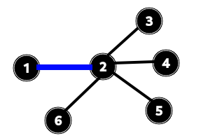

## Tipos de Emparejamiento en Grafos
### Estudiante
**Nombre:** Ramirez Caero Ricardo  
**Carrera:** Informatica  
**Cod:** 202308946
### Consigna
Dado un grafo devolver emparejamientos por tipo.
### Ejecucion
Dentro de una clase estatica "Main.java" inicializaremos los vertices, aristas y grafos.
```java
public class Main {
    public static void main(String[] args) {
        Grafo grafo = new Grafo(false);
        Vertice a = new Vertice("a");
        Vertice b = new Vertice("b");
        Vertice c = new Vertice("c");
        Vertice d = new Vertice("d");
        Vertice e = new Vertice("e");
        grafo.addVertice(a);
        grafo.addVertice(b);
        grafo.addVertice(c);
        grafo.addVertice(d);
        grafo.addVertice(e);
        grafo.addArista(new Arista(a, b));
        grafo.addArista(new Arista(a, e));
        grafo.addArista(new Arista(b, e));
        grafo.addArista(new Arista(b, d));
        grafo.addArista(new Arista(b, c));
        grafo.addArista(new Arista(c, d));
        grafo.addArista(new Arista(d, e));
    }
}
```
#### Imprimir Grafo y Emparejamientos
Se implemento los metodos "printGrafo() & printEmparejamientos()" para poder visualizar nuestro grafo una vez inicializado.

<p align="center">
  
</p>

```
Grafo - No Dirigido
a: b, e
b: a, e, d, c
c: b, d
d: b, c, e
e: a, b, d

Emparejamientos:
[b, a]
[c, d]
Tipo de emparejamiento:
Emparejamiento maximal
```

#### Grafo Perfecto

<p align="center">
  
</p>

```
Grafo - No Dirigido
1: 2, 3, 6
2: 1, 3
3: 1, 2, 4, 5
4: 3, 5
5: 3, 4, 6
6: 1, 5

Emparejamientos:
[2, 1]
[3, 4]
[5, 6]
Tipo de emparejamiento:
Emparejamiento perfecto
```

#### Grafo Maximo

<p align="center">
  
</p>

```
Grafo - No Dirigido
1: 2
2: 1, 3, 4, 5, 6
3: 2
4: 2
5: 2
6: 2

Emparejamientos:
[2, 1]
Tipo de emparejamiento:
Emparejamiento maximo
```

#### Grafo Maximal

<p align="center">
  
</p>

```
Grafo - No Dirigido
1: 2, 5
2: 1, 4
3: 4, 5
4: 2, 3
5: 3, 1

Emparejamientos:
[2, 1]
[4, 3]
Tipo de emparejamiento:
Emparejamiento maximal
```

### Repositorio
<https://github.com/Richixs/tipos-de-emparejamientos-en-grafos>
